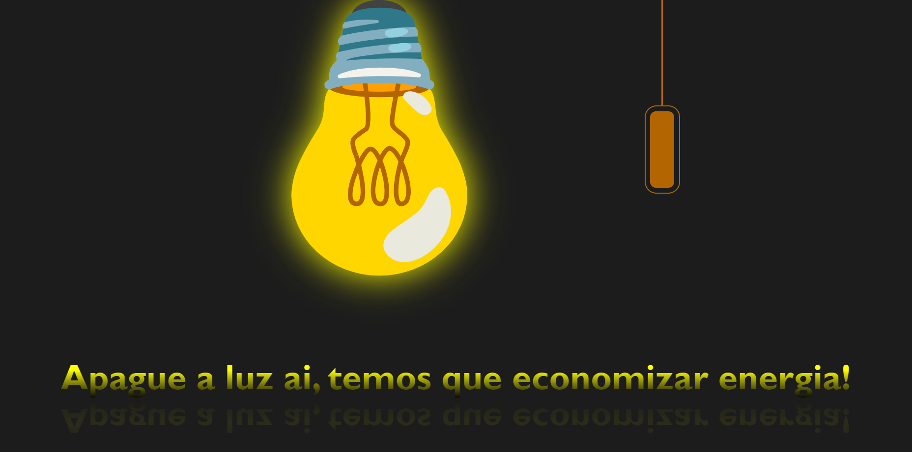

<h1 align="center"> Exercício da Lampada </h1>

Exercício da lampada feito através das aulas da AdaTech voltado para manipulação de eventos JS e DOM 

 

  

## 🚀 Tecnologias

Esse projeto foi desenvolvido com as seguintes tecnologias:

- HTML e CSS
- JavaScript
- Git e Github

## 💻 Projeto

O exercício da lampada foi desenvolvido com o intuito de aprimorar as habilidades de manipulação de eventos e do DOM através do JS, além de maiores conhecimentos voltados a imagens SVG e sua manipulação tanto através de CSS quanto de JS.

## Créditos

Feito por Dário Klein.
